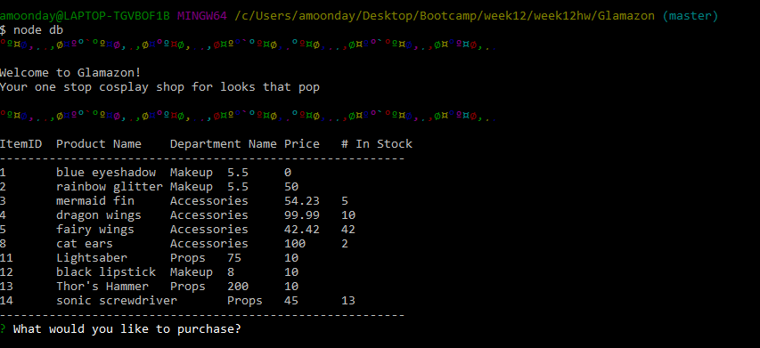
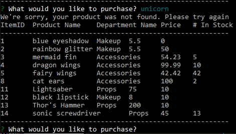

# Glamazon
A one stop cosplay shop for looks that pop

Welcome to Glamazon, an imaginary cosplay shop specializing in outfits for imaginary adventures. 

Our first challenge was attempting to use the npm package unicorn - alas, unicorn eluded our development team. Luckily, we found rainbow instead.

To begin your Glamazon adventure, enter "node db" at the command line. 

Select your product from the menu of items. Or be difficult and ask for a unicorn.

If you choose to be difficult, our kindly shop-fairies will redisplay the menu of items. You may then choose a (real) product

Of course, we display the stock level on the menu, but if a user selects it anyway, our shop-fairies display a helpful message.  In the future, we hope to develop a back order process for items that are temporarily out of stock (yet not impossible to obtain, like unicorns).

Once you have selected a valid item, enter the quantity you wish to purchase.
(We do not have support for trying to order more than what is in stock - you will likely encounter an error. This must've slipped our minds.  I blame it on the a a a a a absinthe).

Our shop-fairies will helpfully ask if you would like to continue shopping.  Of course you do! We will helpfully keep a running total for you.  When you are finished, tell us you would no longer like to continue shopping.

Our final message will present the total cost of your order.  In the future, we'd also like to display your chosen items. But that is a future quest.

